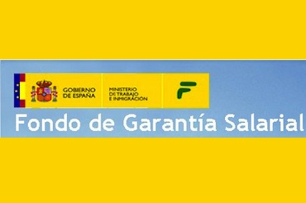

<h1>Trabajo de la Unidad 10</h1>

**Adonay Gonzalez Gutiérrez**

<h1>Indice</h1>

- [Busca el SMI del año 2023 y copia el enlace en la tarea.](#busca-el-smi-del-año-2023-y-copia-el-enlace-en-la-tarea)
- [Ejercicio 2](#ejercicio-2)
- [Ejercicio 3](#ejercicio-3)

# Busca el SMI del año 2023 y copia el enlace en la tarea.

**Salario Minimo Interprofesional**

[Link aqui](https://www.mites.gob.es/es/Guia/texto/guia_6/contenidos/guia_6_13_2.htm)  
En el link nos enviara al la oppagina del goibierno. un ue nos da lo datos oficiales del 2022, aunque fuera de esa pagian encontre que es de 1080€ en 14 pagas

# Ejercicio 2
**Calcula el embargo del salario de un trabajador que gana 2800€ al mes. Tiene una deuda de 14500 € por no haber abonado las rentas de su alquiler. El juzgado ha mandando orden de embargar parte legal del salario y el ingreso en la cuenta de consignación del juzgado. Además debes indicar en cuantas mensualidades debes realizar la retención en la nómina e ingresarla en la cuenta de consignación del Juzgado.**
 

Dado que el salario del trabajador (2800€) cae dentro del rango de 2.200,01 a 3.000,00 €, el porcentaje embargable sería del 50%.

Por lo tanto, el monto embargable sería:

Embargo = 2800€ * 0.50 = 1400€ al mes

Para calcular el número de mensualidades necesarias para cubrir la deuda de 14500€, dividimos la deuda total por el monto embargable:

Número de mensualidades = 14500€ / 1400€ ≈ 10.36
Lo que podriamos decir que serian 11 mensualidades.
Un dato importante es que depende tambien de la situacion de la persona, cargas familiares, etc.. esto haria variar los porcentajes.

# Ejercicio 3
**Calcula la cantidad que va a pagar el FOGASA a un trabajador que el juzgado ha dictado sentencia en el que se le reconoce un salario adeudado de 23.500€, y una indemnización de 45.000€, más un salario de tramitación de 25000 €.. Deben buscar en la aplicación del FOGASA. Antigüedad 1-2-2010. Extinción 20-10-22, fecha demanda 20-10-22.**

- Para los salarios adeudados:
    - Salario adeudado: 23.500€
    - Límite FOGASA para salarios: 10.534,80€
    - Cantidad a abonar por el FOGASA: 10.534,80€ (máximo permitido)

- Para la indemnización:
    - Indemnización: 45.000€
     -Límite FOGASA para indemnizaciones: 32.043,35€
     -Cantidad a abonar por el FOGASA: 32.043,35€ (máximo permitido)

Sumando ambos montos:

Cantidad total que el FOGASA pagaría al trabajador = 10.534,80€ (salario adeudado) + 32.043,35€ (indemnización) = 42.578,15€

Entonces, el FOGASA pagaría un total de 42.578,15€ al trabajador.

Estas operaciones las he llevado a cabo con la informacion de la siguiente pagina
[Link](https://www.mites.gob.es/fogasa/faqs.html)

